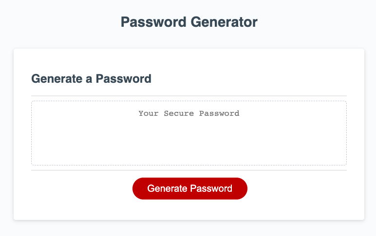
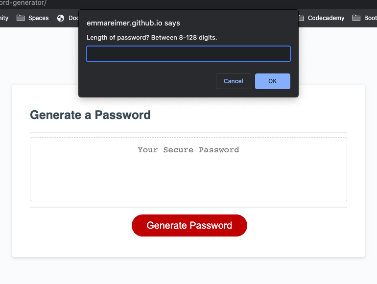
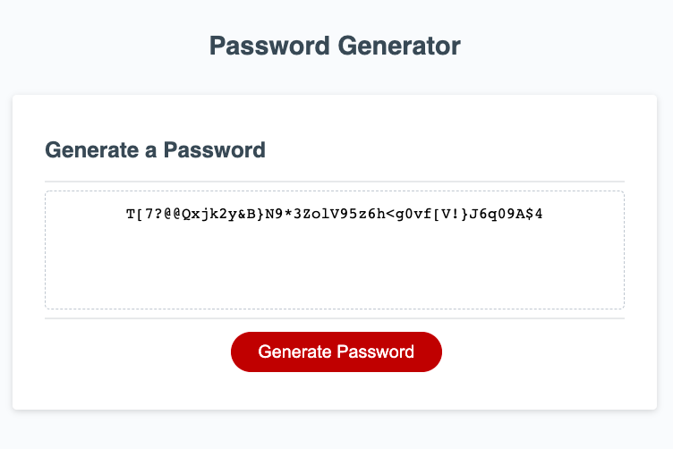

# password_generator

## Description
The password generator will prompt the user to choose the length of the password and what characters the user wants to include. After all of the prompts have been answered, the password generator will generate a random password.

## Usage
The password generator can be used to generate a truly random password with to the specifications that the user chooses.

The application can be found here: https://emmareimer.github.io/password-generator/

The following images show the web application's appearance and functionality:

